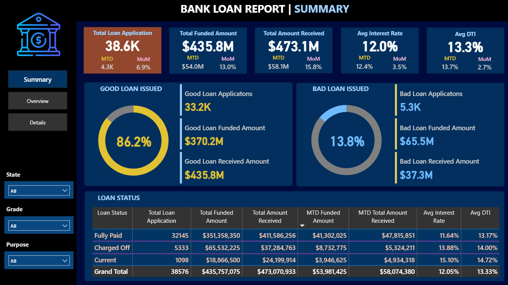
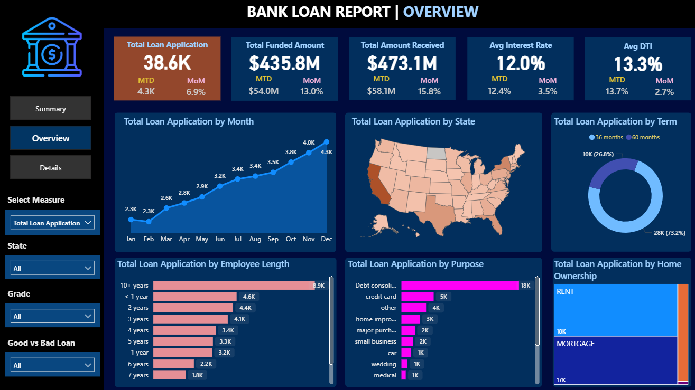
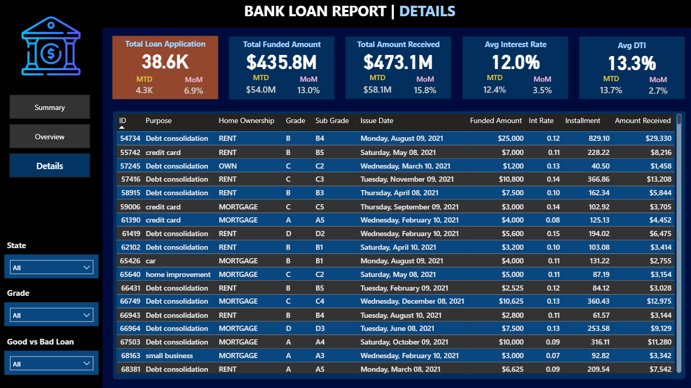
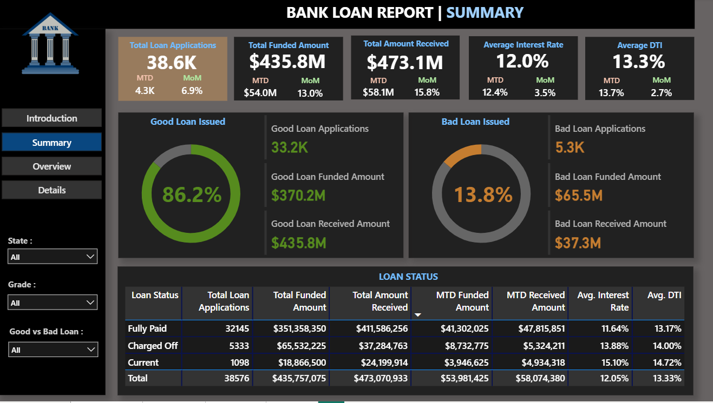

# 💳 Bank Loan Analysis Dashboard – Power BI + SQL Server

  
  
  
  
  
  

---

## 📌 Overview

This project presents a professional **Bank Loan Report Dashboard** built using **Power BI**, powered by data from **Microsoft SQL Server**.  
It provides a comprehensive view of loan applications, funding, defaults, and key performance indicators — optimized for **insightful business decision-making**.

> 🎯 Inspired by a real-world finance use case and developed as a **hands-on BI solution**. 

---

## 🎯 Project Objectives

- 🔗 Connect Power BI to SQL Server using **live data**  
- 🧹 Clean and model raw data into **meaningful insights**  
- 📊 Enable decision-makers to explore **interactive KPIs**  
- 🤖 Build a base for future **Python visuals & ML models**  

---

## 🖼 Dashboard Previews

### 🔹 Summary Page  

### 🔹 Overview Page  

### 🔹 Details Page  

---

## 📊 Dashboard Highlights

- 📌 **38K+ Loan Applications** analyzed  
- 📈 Key KPIs with **MTD** and **MoM** performance:  
  - Total Funded Amount  
  - Total Received Amount  
  - Average Interest Rate  
  - Average Debt-to-Income (DTI)  

- ✅ **Good vs. Bad Loan Segmentation** with donut charts & stats  
- 📋 **Loan Status Breakdown**: Fully Paid | Charged Off | Current  
- 📅 Month-wise **Funded & Received summaries**  
- 🎯 **Dynamic Slicers** by State, Grade, Purpose, Loan Quality  
- 🗂️ Clean navigation: **Summary | Overview | Details**  

---

## 🛠 Tech Stack

| Tool | Purpose |
|------|---------|
|  | Data Visualization & Dashboarding |
|  | Backend Database |
|  | Custom Measures & KPIs |
|  | Future Visuals & ML |
|  | Data Preprocessing |

---

## 🧠 Skills Demonstrated

- 🔹 Advanced **SQL Data Querying & Joins**  
- 🔹 Data Modeling & Relationships in **Power BI**  
- 🔹 Building **Custom DAX Measures**  
- 🔹 Dashboard **UX/UI Design** Principles  
- 🔹 Professional **Presentation & Storytelling**  

---

## 🖼 Dashboard Screenshots

| Summary Page | Alternate Theme |
|--------------|-----------------|
|  |  |

---

## 🚀 Future Enhancements

- ✅ Integrate **Python visuals** for advanced insights  
- ✅ Add **drill-through pages** with detailed analysis  
- ✅ Introduce **ML-based Loan Approval Predictions**  
- ✅ Embed **dynamic tooltips** for richer storytelling  

---

## 📌 Project Status

- [x] SQL Integration Complete  
- [x] Power BI Dashboard Designed & Published  
- [x] Presentation (PPT) Prepared  
- [ ] Python & ML Enhancements in Development  

---

## 📎 License

📖 This project is intended for **educational & portfolio showcase purposes**.  
❌ Not for commercial use.  

---

## 🔗 Connect With Me

👨‍💼 **Rohit Lakha**  
📍 Data Analyst | BI Developer | SQL & Power BI Enthusiast  

  
  

---
